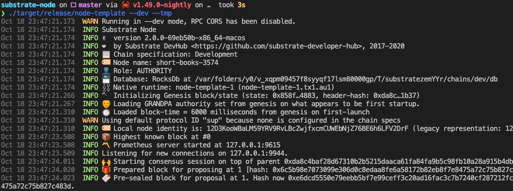
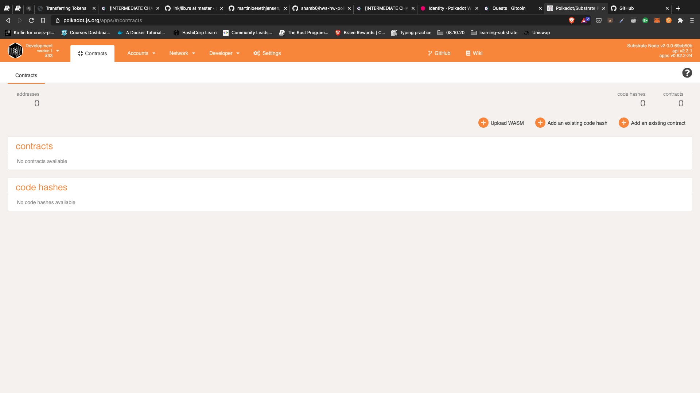
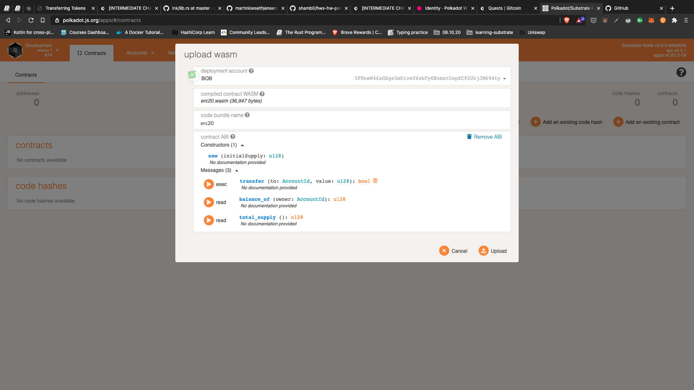
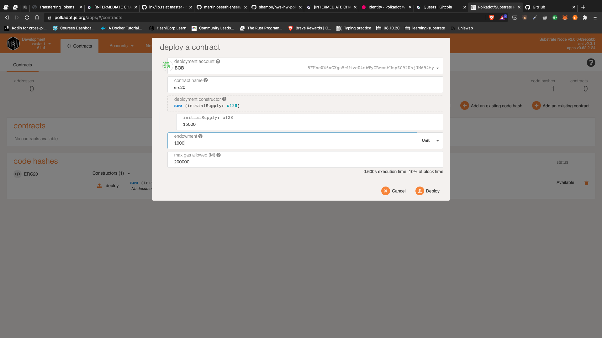
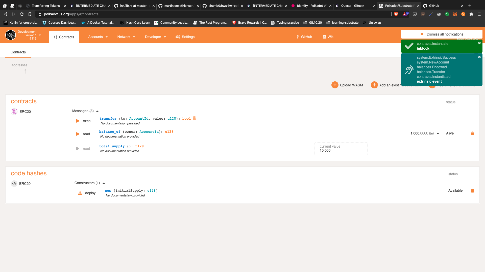
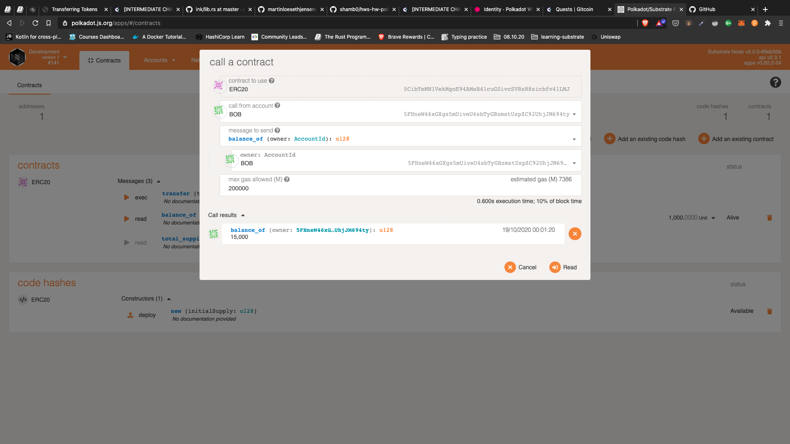
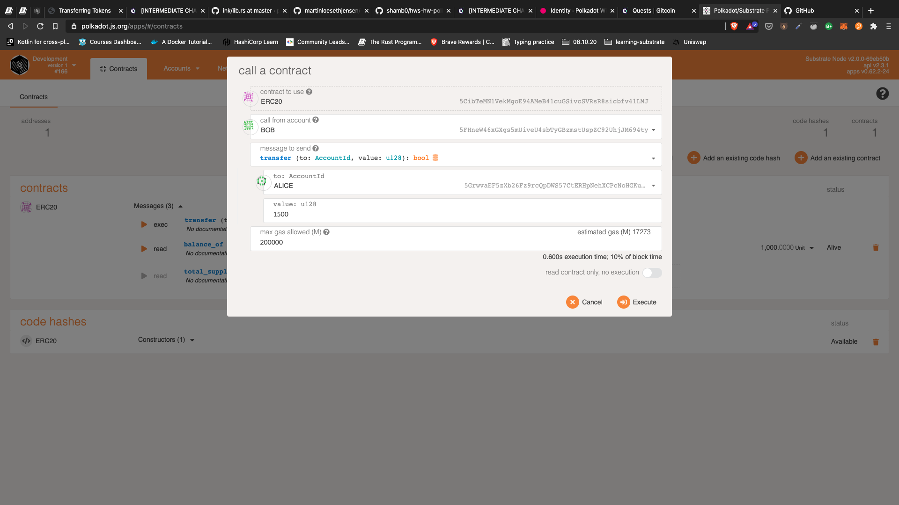
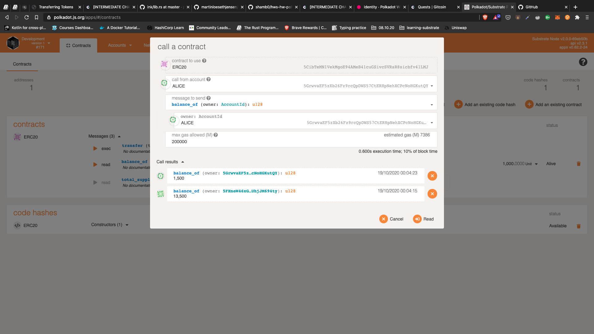

# 🧑‍💻 [INTERMEDIATE CHALLENGE] Smart contracts - write an ERC-20 smart contract with ink!

## Repos

[My Substrate node with contracts pallet repo](https://github.com/martinloesethjensen/substrate-node)

[My front-end repo](https://github.com/martinloesethjensen/substrate-front-end)

## Intro

ERC-20 contract is from this [ink example](https://github.com/paritytech/ink/tree/master/examples/erc20)

Followed this example to [build an erc20 with ink](https://substrate.dev/substrate-contracts-workshop/#/2/introduction)

Followed this to make the front-end interact with the [contracts api](https://polkadot.js.org/docs/api-contracts)

## Guide

Build erc20 Contract by navigating to `erc20` and the instructions on [building your contract](https://substrate.dev/substrate-contracts-workshop/#/0/building-your-contract)

1. Run the node first.
2. Go to [polkadot app](https://polkadot.js.org/apps/#/contracts).
3. "Upload WASM" with [erc20.wasm](erc20/target/erc20.wasm) and put in [metadata.json](erc20/target/metadata.json) as "contract ABI".
4. Deploy Contract.
5. Execute calls on the contract.

## Guide with Screenshots

### 1: Run the Node

Run [this node](https://github.com/martinloesethjensen/substrate-node) that has the contracts pallet implemented.

### 2: Go to [polkadot app](https://polkadot.js.org/apps/#/contracts)

### 3: Upload WASM

Click on "Upload WASM" and upload [erc20.wasm](erc20/target/erc20.wasm) and put in [metadata.json](erc20/target/metadata.json) as "contract ABI".

### 4: Deploy Contract

### 5: Execute Calls on the Contract

