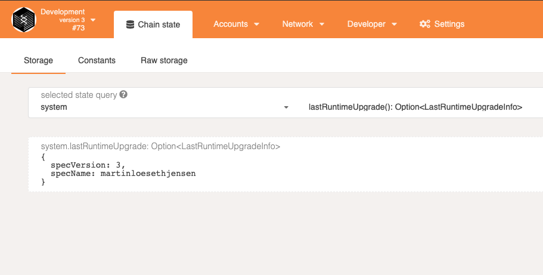

# 🧑‍💻 [INTERMEDIATE CHALLENGE] Forkless Upgrades

I had to follow the [tutorial](https://substrate.dev/docs/en/tutorials/upgrade-a-chain/) before changing `spec_name` as I got an error.

The reason for the error is that the [API and node does not match 100%](https://polkadot.js.org/docs/api/FAQ/#the-node-returns-a-could-not-convert-error-on-send)
Hence the node could not parse the data.

So, I finished the tutorial and then in the end changed `spec_name` for the screenshot proof. 

