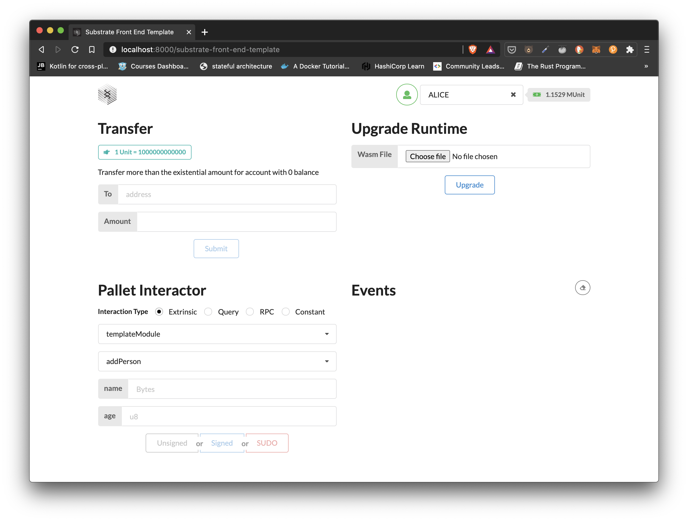
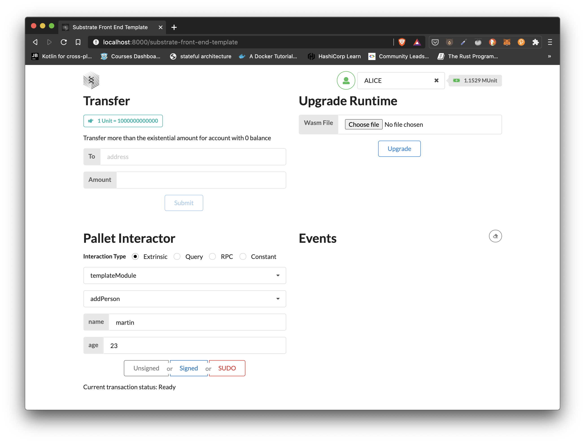
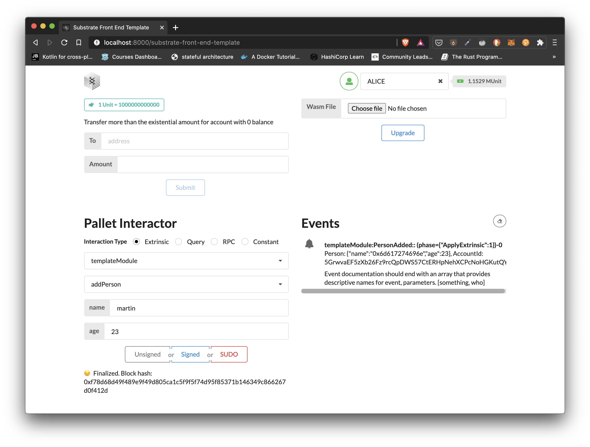

# 🧑‍💻 [INTERMEDIATE CHALLENGE] FRAME Development

## Challenge Description

Update the [Pallet Template](https://github.com/substrate-developer-hub/substrate-pallet-template) to include a [storage item for a custom struct](https://substrate.dev/recipes/structs.html). Add at least one dispatchable function to interact with the new storage item. [Add the necessary types](https://polkadot.js.org/api/start/types.extend.html) to the [Front-End Template](https://github.com/substrate-developer-hub/substrate-front-end-template) to interact with the new dispatchable.

### Submission Requirements

Provide a link to a GitHub repository that includes the Node Template with the updated pallet as well as the updated front-end template.

## Submission

[Front-end repo](https://github.com/martinloesethjensen/substrate-front-end/tree/frame-development-challenge) with the custom types added to it.

[Substrate node](https://github.com/martinloesethjensen/substrate-node/tree/frame-development-challenge) with updated pallet template that includes a storage item for a custom struct.

## Screenshots

