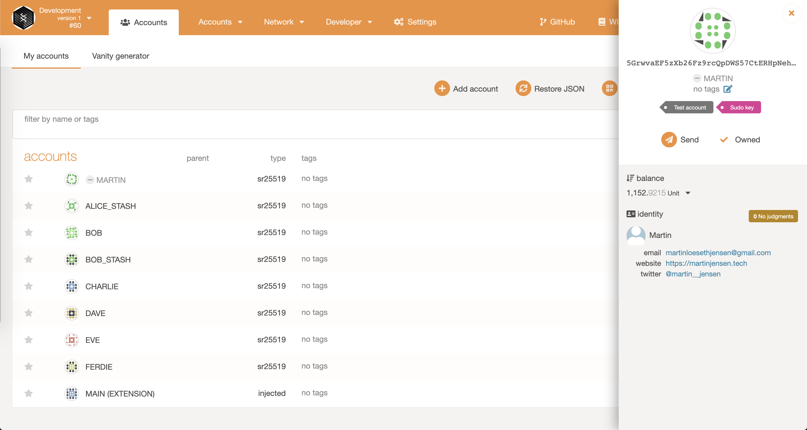
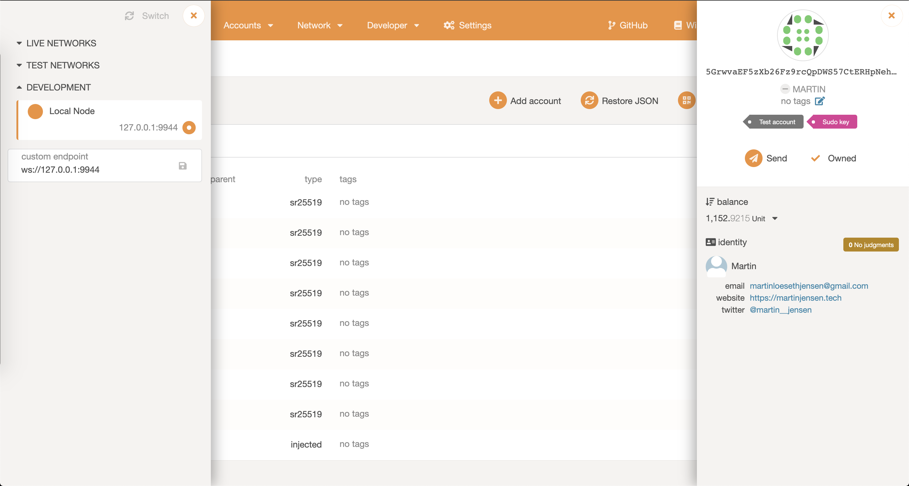

# 🧑‍💻 [INTERMEDIATE CHALLENGE] FRAME Identity: Set an identity on a local --dev chain

## Submission

[Substrate node repo with the Identity pallet](https://github.com/martinloesethjensen/substrate-node-identity)

### Screenshots

