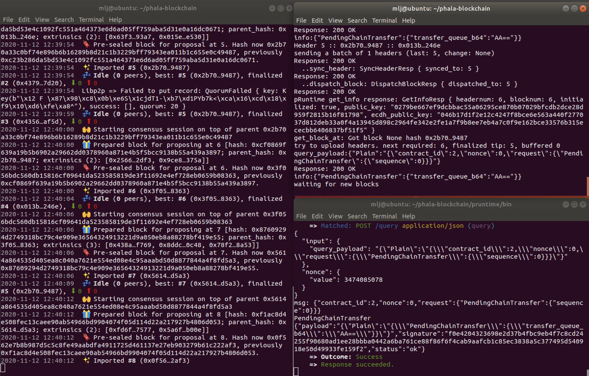
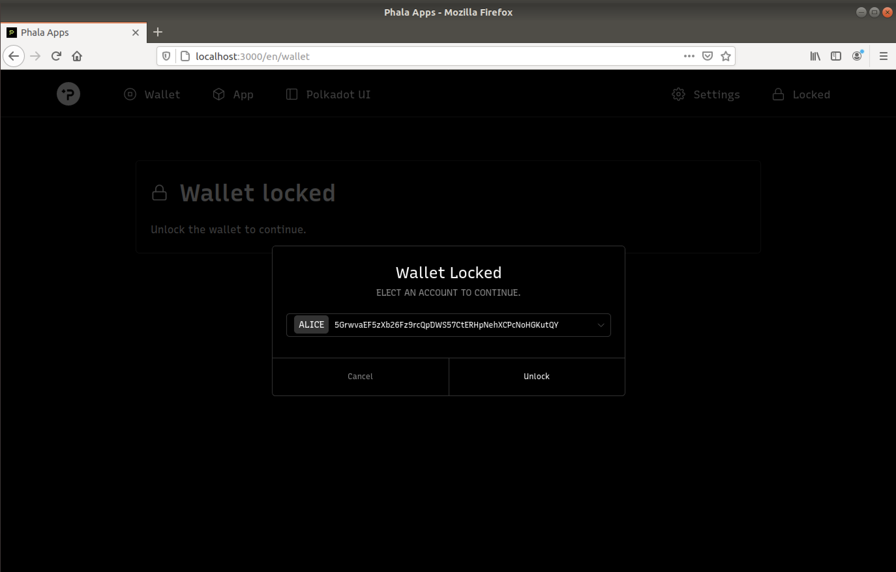
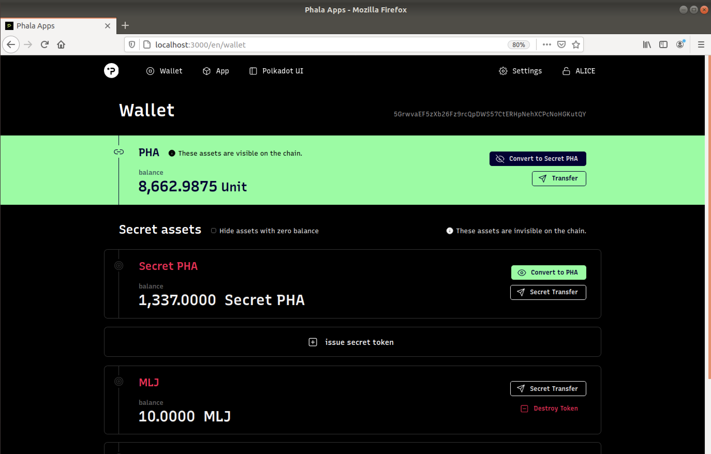

# 🧑‍💻 [ECOSYSTEM CHALLENGE] (Beginner) Build and Run a Local Phala Network

## Challenge Description

In this challenge, you are going to set up a Phala Network "Hello World" development environment, and deploy a full stack of the core blockchain and connect the Web UI to the blockchain. You will try the privacy-preserving “secret tokens” feature on your own local testnet.

This is the first challenge of our “Hello World” challenge series. By the end of this task, you will be able to:

- end confidential transactions
- Get a ready-to-hack version of Phala Network for building your own confidential Dapps

Follow our [Tutorial](https://wiki.phala.network/en-us/docs/) for detailed instructions.

## Submission Description

1. Take screenshots of the terminal window with the running core blockchain (phala-node, pruntime, and phost)
2. Take a screenshot of your user-issued secret token
3. Send the screenshot and share your feeling on Twitter
4. Join our [Discord server](https://discord.gg/zQKNGv4) and submit the the link to your tweet

## Submission

[Link to tweet](https://twitter.com/martin__jensen/status/1326996059458039809)

