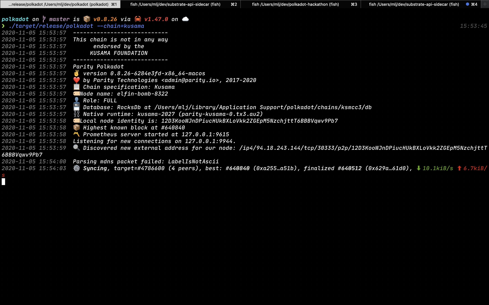
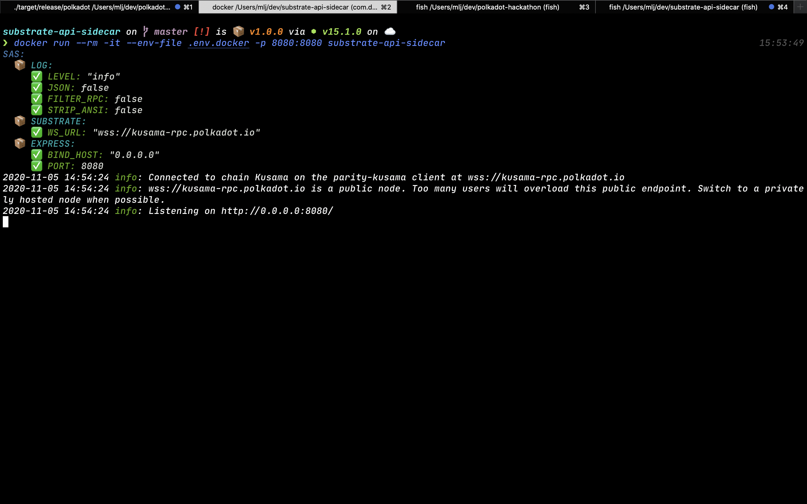
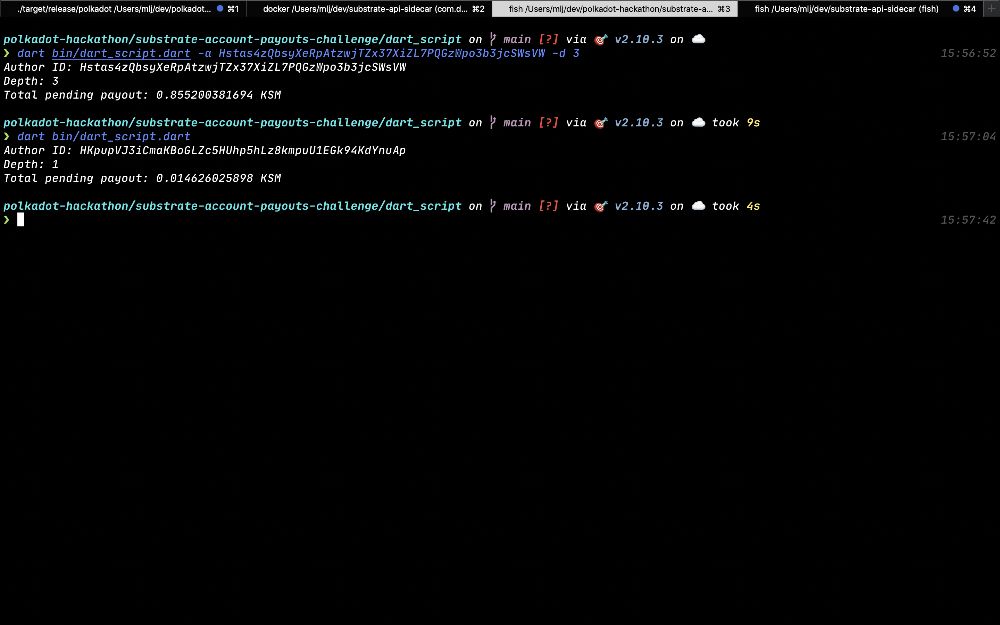

# 🧑‍💻 [ADVANCED CHALLENGE] REST APIs - Read an account's pending payouts

## Submission Requirements

Provide a link to a Gist or Github repository that demonstrates a script to calculate pending payouts by sending HTTP requests to a local Sidecar instance.

## Submission

[Script directory](dart_script)

[Gist of dart script](https://gist.github.com/martinloesethjensen/42bae400485d772587504e1efbeefa70)

## Start a Local Kusama Node

Clone [polkadot repo](https://github.com/paritytech/polkadot) and run local kusama node as seen below.

## Start a Local Sidecar Instance

Clone [sidecar repo](https://github.com/paritytech/substrate-api-sidecar) and run local sidecar instance as seen below.

## Running Script

Follow the [dart_script README.md](dart_script/README.md) on how to run the script.

